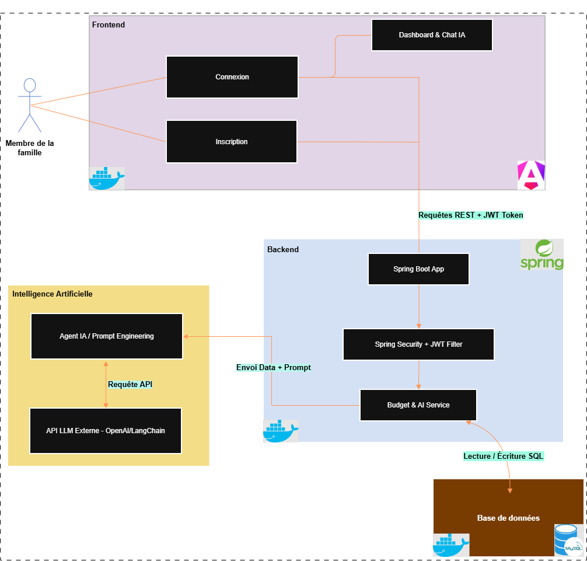
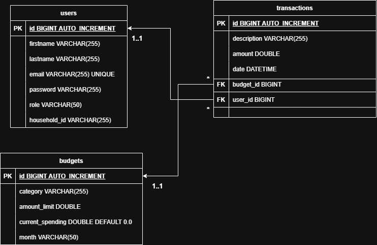

# 🏠 Household Budget Management System

## Présentation
Le projet **Household Budget Management System** est une application web intelligente conçue pour la gestion des finances familiales. Elle permet aux membres d'une famille de suivre leurs dépenses en temps réel et de bénéficier de recommandations personnalisées grâce à un **Agent IA** (Agentic AI) capable d'analyser les habitudes de consommation pour optimiser l'épargne.

## Architecture du Système
L'application repose sur une architecture moderne en micro-services conteneurisés, assurant une séparation nette entre l'interface utilisateur, la logique métier et le moteur d'intelligence artificielle.

## Schéma de la Base de Données
Le modèle de données est conçu pour assurer une traçabilité complète des flux financiers au sein du foyer. Il lie chaque transaction à un utilisateur spécifique et à une catégorie budgétaire définie.

## 🛡️ Sécurité et Configuration
Une attention particulière a été portée à la protection des données sensibles (Credentials base de données et clés secrètes JWT).

[!IMPORTANT] Gestion des secrets et confidentialité : Pour ne pas diffuser la clé secrète du Token ainsi que les identifiants de la base de données sur un dépôt public, le fichier application.properties est ignoré par Git.

### Solution mise en place :

application.properties.example : Ce fichier est public et sert de guide de configuration. Il contient la structure nécessaire sans les valeurs réelles.

application.properties : Ce fichier reste uniquement en local (non diffusé). Il contient les clés réelles nécessaires au fonctionnement de l'application.

Après avoir cloné le projet, veuillez copier le fichier .example vers un nouveau fichier application.properties et y renseigner vos propres paramètres.